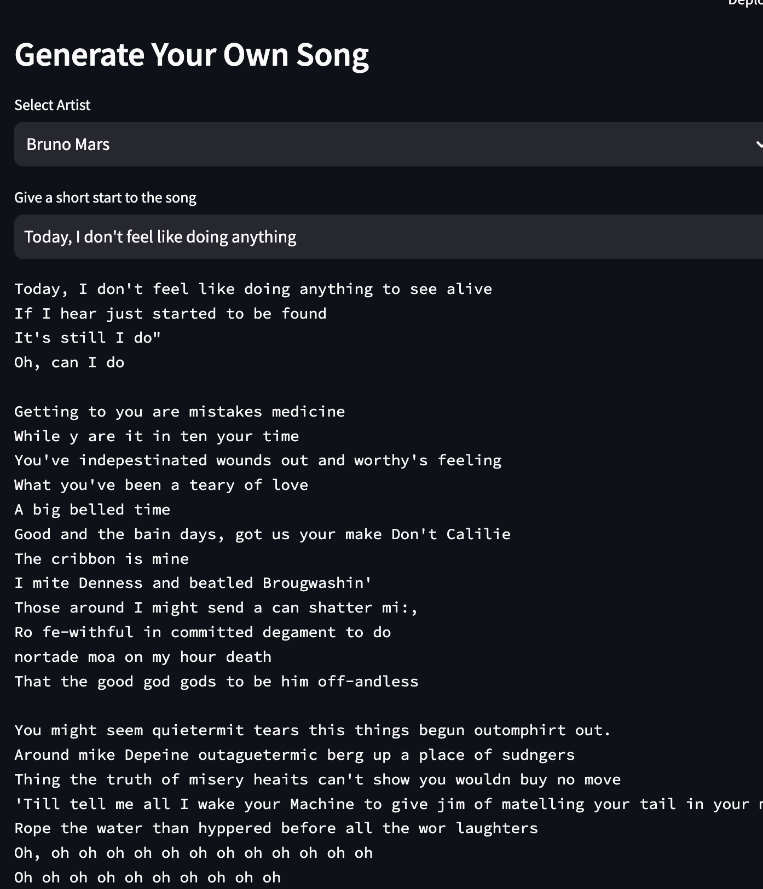

# Song Generation Language Model (nanoGPT)

## Overview

This project implements a character-level language model for generating songs. The model is trained on a dataset of Spotify songs obtained from Kaggle, using the nanoGPT architecture – a lightweight version inspired by the main GPT model. The nanoGPT used in this project has 20 million parameters.

## Model Details

- Model: nanoGPT (20M parameters)
- Training Loss: 0.99
- Validation Loss: 1.02

## Dataset

The training data is sourced from the Kaggle Spotify Songs dataset. Ensure you have the dataset downloaded.
## Getting Started

1. Clone the repository:

2. Install dependencies:

3. Download and prepare the dataset. Include instructions on how to do this.

4. Train the model:

5. Generate songs using the trained model:

## Demo Images

